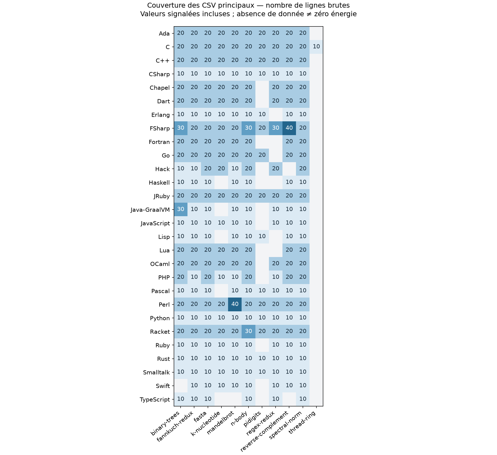
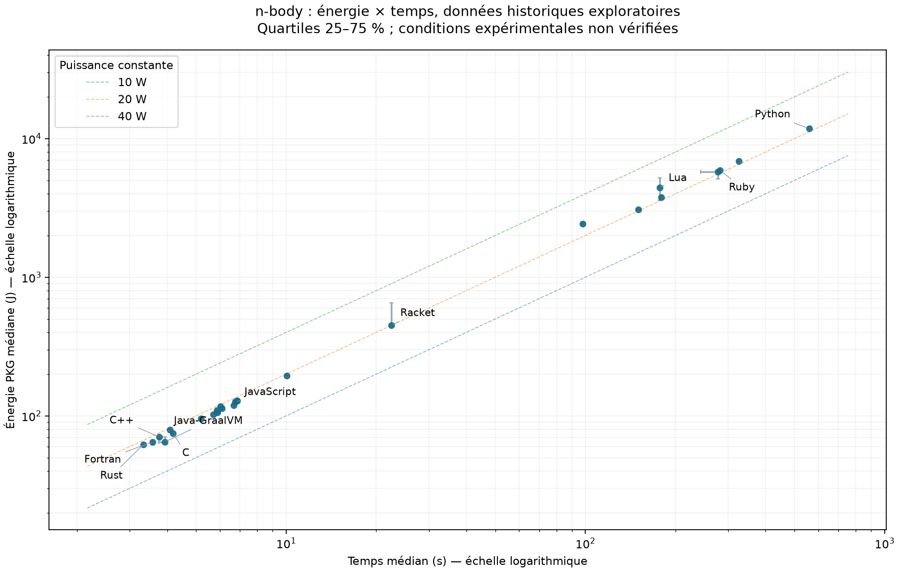

# Résultats historiques et analyses croisées

**Ces résultats proviennent des CSV hérités du projet Energy-Languages. Ils ne constituent ni une nouvelle campagne INR, ni une reproduction validée du classement de l’article de 2017.**

Cette page est générée à partir des fichiers locaux. Le matériel, les versions des compilateurs, les paramètres et les codes de sortie de chaque observation ne sont pas enregistrés dans les CSV. Les Makefiles actuels ne permettent pas de les reconstituer avec certitude. Les corrections INR du programme de mesure ne valident pas rétroactivement ces données.

## Ce que contient le dépôt

- **33 fichiers CSV**, soit **4450 observations lisibles**.
- **28 fichiers principaux**, **3950 observations** et **253 séries configuration × benchmark**.
- **11 benchmarks représentés** ; leur couverture varie selon la configuration.
- **5 variantes `x*.csv`**, conservées séparément : 500 lignes, dont 400 ont exactement les mêmes valeurs qu’une ligne du fichier principal du même langage.
- Le dossier Java ne contient pas de CSV ; `Java-GraalVM/GraalVM.csv` est une configuration distincte.



Les nombres dans la matrice comptent les lignes brutes, y compris les valeurs signalées. Une cellule vide signifie absence de données, et non consommation nulle.

## Qualité des données et règles de traitement

- **34 lignes principales contiennent au moins une énergie négative**. Cela peut notamment être compatible avec un débordement de compteur, mais la cause ne peut pas être établie ici. Elles ne sont ni ramenées à zéro ni corrigées par une constante supposée.
- **39 lignes principales numériquement invalides** sont retirées des statistiques (énergie négative, valeur non finie, PKG absent/non positif ou temps absent/non positif).
- **130 lignes principales durent moins de 10 ms**. Ce seuil de dépistage ne prouve pas un échec ; il signale des observations à vérifier avec les sorties du programme.
- **23 séries** sont écartées des corrélations et du nuage exploratoire : au moins une durée < 10 ms, moins de 5 lignes valides, ou rapport > 2 entre les médianes temporelles de blocs contigus du même benchmark.
- Un « bloc » désigne uniquement une séquence contiguë de lignes portant le même nom de benchmark. Ce n’est pas un identifiant de session expérimental. Des changements internes à un bloc peuvent donc rester indétectables.
- Les variantes `x*.csv` ne sont pas ajoutées aux fichiers principaux : leur statut expérimental est inconnu. Le choix du fichier non préfixé est une convention de cette analyse, pas une preuve de meilleure qualité.
- 1 en-tête reconnu et 2 lignes vides ignorés ; 0 lignes malformées. L’en-tête GraalVM annonce cinq champs mais les lignes en comportent six : les positions effectives `benchmark, PKG, CPU, GPU, DRAM, temps` sont utilisées, conformément au code du programme de mesure.

Les séries écartées restent dans les [tables détaillées](results/TABLES.md) et les exports. « Aucun filtre déclenché » ne signifie pas « mesure validée ». Les filtres peuvent introduire un biais de sélection ; ils servent à une exploration prudente, pas à reconstruire des données scientifiques manquantes.

### Séries écartées des croisements

| Configuration | Benchmark | Durées < 10 ms (lignes) | Rapport des médianes de blocs | Signalements |
|---|---|---:|---:|---|
| C++ | fannkuch-redux | 10 | 4 195.1 | short_time, block_shift |
| FSharp | binary-trees | 0 | 594.0 | block_shift |
| FSharp | fannkuch-redux | 0 | 275.5 | block_shift |
| FSharp | fasta | 0 | 135.6 | block_shift |
| FSharp | k-nucleotide | 0 | 368.6 | block_shift |
| FSharp | mandelbrot | 0 | 174.2 | block_shift |
| FSharp | n-body | 0 | 200.8 | block_shift |
| FSharp | pidigits | 0 | 24.0 | block_shift |
| FSharp | regex-redux | 0 | 1 188.6 | block_shift |
| FSharp | reverse-complement | 0 | 265.6 | block_shift |
| FSharp | spectral-norm | 0 | 35.8 | block_shift |
| Java-GraalVM | regex-redux | 10 | 1.0 | invalid_rows_removed, short_time |
| Java-GraalVM | reverse-complement | 10 | 1.0 | invalid_rows_removed, short_time |
| Smalltalk | binary-trees | 10 | 1.0 | short_time |
| Smalltalk | fannkuch-redux | 10 | 1.0 | short_time |
| Smalltalk | fasta | 10 | 1.0 | invalid_rows_removed, short_time |
| Smalltalk | k-nucleotide | 10 | 1.0 | short_time |
| Smalltalk | mandelbrot | 10 | 1.0 | short_time |
| Smalltalk | n-body | 10 | 1.0 | invalid_rows_removed, short_time |
| Smalltalk | pidigits | 10 | 1.0 | short_time |
| Smalltalk | regex-redux | 10 | 1.0 | short_time |
| Smalltalk | reverse-complement | 10 | 1.0 | short_time |
| Smalltalk | spectral-norm | 10 | 1.0 | short_time |

## Exemple lisible : n-body

Valeurs descriptives par configuration, triées alphabétiquement. Les séries exclues restent affichées pour rendre les anomalies visibles. Les comparaisons supposeraient des charges et conditions identiques, ce que ces CSV ne prouvent pas.

| Configuration | n valides/brut | Énergie PKG médiane (J) | Temps médian (s) | Puissance médiane (W) | Croisements exploratoires |
|---|---:|---:|---:|---:|---|
| Ada | 20/20 | 79.561 | 4.085 | 19.468 | retenue |
| C | 20/20 | 74.811 | 4.191 | 17.795 | retenue |
| C++ | 20/20 | 70.363 | 3.770 | 18.662 | retenue |
| CSharp | 10/10 | 113.463 | 6.110 | 18.563 | retenue |
| Chapel | 20/20 | 95.329 | 5.201 | 18.079 | retenue |
| Dart | 20/20 | 128.830 | 6.825 | 18.846 | retenue |
| Erlang | 10/10 | 3 075.779 | 150.143 | 20.290 | retenue |
| FSharp | 30/30 | 127.030 | 7.104 | 18.356 | écartée |
| Fortran | 20/20 | 64.548 | 3.571 | 18.070 | retenue |
| Go | 20/20 | 105.746 | 5.899 | 17.926 | retenue |
| Hack | 19/20 | 5 744.862 | 276.828 | 20.976 | retenue |
| Haskell | 10/10 | 195.235 | 10.046 | 19.473 | retenue |
| JRuby | 19/20 | 2 423.475 | 97.975 | 24.680 | retenue |
| Java-GraalVM | 10/10 | 64.751 | 3.930 | 16.477 | retenue |
| JavaScript | 10/10 | 126.240 | 6.762 | 18.659 | retenue |
| Lisp | 10/10 | 119.451 | 6.685 | 17.870 | retenue |
| Lua | 20/20 | 4 412.315 | 176.923 | 23.899 | retenue |
| OCaml | 20/20 | 109.368 | 5.858 | 18.671 | retenue |
| PHP | 19/20 | 3 758.207 | 179.018 | 21.007 | retenue |
| Pascal | 10/10 | 102.359 | 5.701 | 17.954 | retenue |
| Perl | 19/20 | 6 853.087 | 325.311 | 21.065 | retenue |
| Python | 9/10 | 11 779.833 | 559.663 | 21.050 | retenue |
| Racket | 30/30 | 451.323 | 22.442 | 19.809 | retenue |
| Ruby | 10/10 | 5 929.687 | 281.297 | 21.073 | retenue |
| Rust | 10/10 | 61.992 | 3.329 | 18.580 | retenue |
| Smalltalk | 8/10 | 0.012 | 0.001 | 16.029 | écartée |
| Swift | 10/10 | 117.067 | 6.026 | 19.416 | retenue |
| TypeScript | 10/10 | 128.146 | 6.856 | 18.671 | retenue |



Axes logarithmiques ; chaque point représente une série retenue par les filtres. Les barres montrent les quartiles 25–75 %, pas des intervalles de confiance. Les traits obliques sont des puissances constantes `E = P × t`.

## Analyses croisées calculées

### 1. Énergie × temps, à benchmark fixé

Corrélation de Spearman entre médianes de séries retenues, calculée séparément par benchmark. Les répétitions ne sont pas traitées comme des langages indépendants. Les ex æquo reçoivent le rang moyen. Une forte corrélation décrit une association ; elle n’établit pas que le langage en est la cause.

| Benchmark | Séries retenues | ρ énergie–temps | ρ énergie–puissance |
|---|---:|---:|---:|
| binary-trees | 25 | 0.972 | 0.036 |
| fannkuch-redux | 25 | 0.956 | 0.359 |
| fasta | 26 | 0.980 | -0.182 |
| k-nucleotide | 21 | 0.938 | 0.186 |
| mandelbrot | 25 | 0.979 | 0.433 |
| n-body | 26 | 0.996 | 0.826 |
| pidigits | 13 | 0.989 | 0.533 |
| regex-redux | 19 | 0.979 | 0.044 |
| reverse-complement | 23 | 0.994 | -0.535 |
| spectral-norm | 26 | 0.949 | 0.292 |
| thread-ring | 1 | — | — |

Aucune corrélation globale ne mélange les charges de travail. Les corrélations énergie–puissance ne sont pas indépendantes : la puissance est calculée à partir de l’énergie.

### 2. Énergie × puissance : distinguer consommation et durée

`Pᵢ = E_PKG,ᵢ / (temps_ms,ᵢ / 1000)` en watts ; le tableau donne la médiane des rapports ligne par ligne. Ce n’est pas le rapport de deux médianes, ni une mesure de la puissance totale à la prise.

Sur les séries n-body disponibles, Python/C vaut **157.5×** pour l’énergie médiane, **133.5×** pour le temps médian et **1.18×** pour la puissance médiane. Ces rapports illustrent le rôle de la durée dans cet échantillon ; ils ne sont pas des facteurs universels applicables aux langages.

### 3. Énergie × régularité des mesures

Les exports donnent la médiane, les quartiles et `IQR / médiane × 100` pour l’énergie et le temps. Une forte dispersion ou un déplacement entre blocs motive une inspection des exécutions et du protocole, plutôt qu’une moyenne unique. Les quartiles utilisent une interpolation linéaire au rang `(n−1) × p`.

### 4. PKG × CPU × DRAM

L’export contient la médiane de `CPU/PKG` et l’énergie DRAM médiane lorsque le domaine est renseigné. Le domaine CPU est une composante du package : **ne pas additionner PKG et CPU**. Les domaines disponibles dépendent du matériel ; une valeur manquante reste manquante. **DRAM (J) mesure une énergie, pas la quantité de mémoire utilisée.**

### 5. Énergie × latence : produit énergie–délai

L’export donne la médiane des produits par exécution `EDPᵢ = E_PKG,ᵢ × temps_s,ᵢ`, en J·s. Cet indicateur peut servir à explorer un compromis sur une même charge. Il impose implicitement un choix de pondération et ne constitue pas un score environnemental général. Aucun classement inter-benchmarks n’en est dérivé.

### Exemples de métriques dérivées pour n-body

Configurations choisies pour illustrer la lecture des indicateurs, sans classement. Chaque colonne est une médiane calculée ligne par ligne sur les observations valides.

| Configuration | CPU/PKG (%) | DRAM (J) | EDP (J·s) | IQR énergie / médiane (%) |
|---|---:|---:|---:|---:|
| C | 67.7 | 10.207 | 313.372 | 3.0 |
| Rust | 48.0 | 8.044 | 206.342 | 0.6 |
| Java-GraalVM | 87.2 | — | 254.634 | 11.5 |
| JavaScript | 49.5 | 16.341 | 853.099 | 0.4 |
| Python | 55.5 | 1 352.108 | 6 592 736.886 | 0.4 |

Un tiret indique un domaine non renseigné, pas une énergie nulle. L’IQR décrit la dispersion du fichier agrégé ; il ne sépare pas automatiquement les sessions.

## Analyses à mener lors d’une campagne contrôlée

| Croisement | Question | Données ou contrôles supplémentaires |
|---|---|---|
| Langage × benchmark | Les écarts changent-ils selon la charge ? | Même entrée, sorties vérifiées, versions et options figées ; ratios à une référence par benchmark, puis moyenne géométrique sur une couverture commune seulement. |
| Temps × énergie : front de Pareto | Quels choix évitent un compromis défavorable ? | Même machine et mêmes entrées ; incertitude par répétition et seuil de latence métier. Ne pas déclarer un gagnant sur des différences inférieures à la variabilité. |
| Mémoire maximale × énergie × durée | Une baisse de mémoire réduit-elle l’énergie ? | Ajouter le pic RSS en octets. Il est absent des CSV actuels ; DRAM J ne le remplace pas. |
| Taille d’entrée × langage | Comment les coûts évoluent-ils avec la charge ? | Plusieurs tailles explicitement enregistrées, checksum des entrées et validation des sorties. |
| Parallélisme × puissance × durée | Le gain de temps compense-t-il la hausse de puissance ? | Nombre de threads, affinité CPU, sockets, fréquence et charge de fond contrôlés. |
| Runtime × échauffement | Quelle différence entre démarrage et régime établi ? | Séparer exécutions à froid et à chaud ; versions JVM/JIT, compilateurs et GC ; ordre randomisé. |
| Énergie machine × carbone | Quel impact pour une charge et un lieu donnés ? | Mesure du système complet, périmètre, durée, facteur électrique daté/localisé et émissions incorporées si pertinentes ; aucune conversion fiable depuis les seuls PKG J. |

Les fichiers actuels ne permettent pas de répondre honnêtement aux croisements mémoire ou carbone, ni de distinguer les effets du langage, de l’algorithme, de la version et du matériel.

## Reproduire et réutiliser

Depuis la racine du dépôt :

```sh
python3 scripts/analyze_results.py
# Optionnel : régénérer aussi les graphiques (Matplotlib requis).
python3 scripts/analyze_results.py --plots
python3 -m unittest discover -s tests -v
```

Les calculs et tableaux utilisent uniquement la bibliothèque standard Python. Les graphiques utilisent Matplotlib ; ils sont publiés ici pour être consultables sans installation.

- [Toutes les séries par benchmark](results/TABLES.md)
- [Observations normalisées, provenance et signalements](results/observations.csv)
- [Statistiques des séries principales](results/series.csv)
- [Statistiques par bloc contigu](results/blocks.csv)
- [Corrélations descriptives](results/correlations.csv)
- [Inventaire des sources et empreintes SHA-256](results/sources.csv)
- [Lignes malformées](results/rejected.csv)
- [Limites générales du projet](KNOWN_LIMITATIONS.md)

Sources : CSV conservés dans chaque dossier de langage, [programme de mesure](../RAPL/rapl.c), [projet original Green Software Lab](https://github.com/greensoftwarelab/Energy-Languages). Les auteurs originaux et la licence sont indiqués dans le [README](../README.md).
